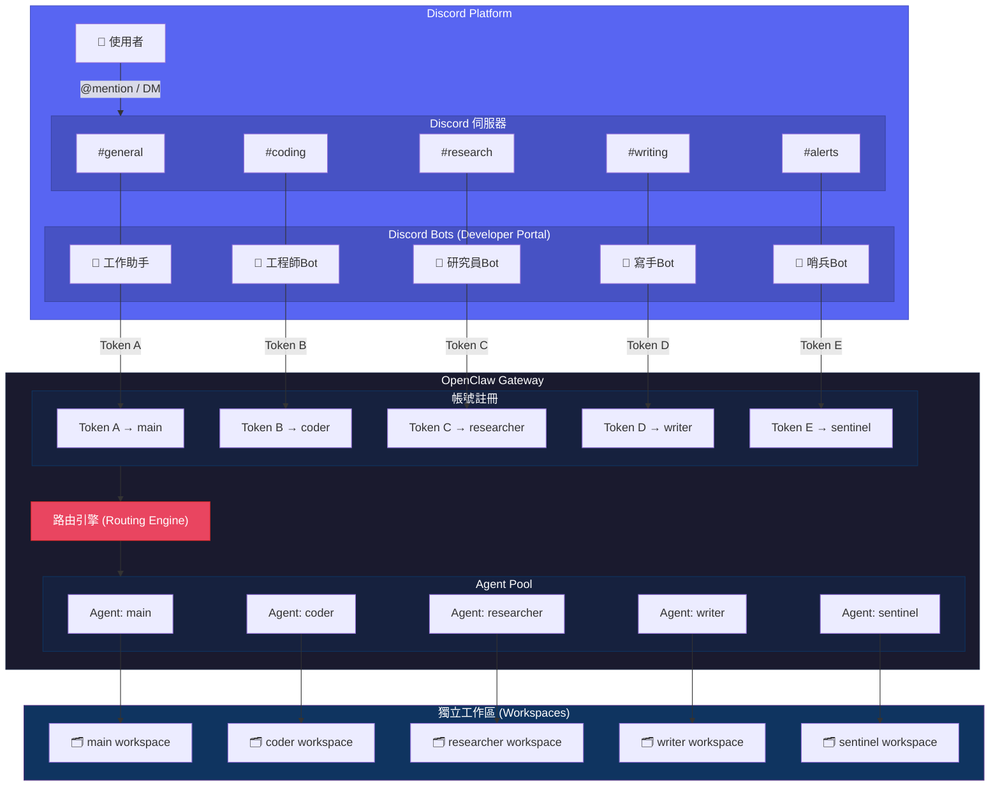

# 🦞 OpenClaw Multi-Agent Discord 配置指南 (專家導向架構)

> [!NOTE]
> 本指南說明如何在**單一 OpenClaw Gateway** 上建立並管理多個專家 Agent，每個 Agent 擁有獨立的 Discord Bot 身分與職責。
>
> **前置條件**：請先完成第一個 Agent（`main`）的 Discord 配置。詳見 [Discord 全功能安裝與配置指南](../platforms/discord.md)。

## 1. 架構總覽

OpenClaw 採用「單一門戶、多維導流」的設計。所有通訊連線統一由 `main` 節點管理，透過路由綁定 (Binding) 將訊息導向各專家的獨立工作區。



### 核心原則

- **一個 Agent = 一個 Discord Bot**：每個 Agent 必須使用獨立的 Bot Token，不可共用。
- **一個 Gateway 管全部**：不需要額外開 Docker 容器，所有 Agent 由同一個 Gateway 統一管理。
- **User ID / Server ID 共用**：所有 Agent 都綁定同一個使用者與伺服器。

## 2. 規劃你的專家陣容

在開始之前，先規劃好每個 Agent 的名稱、對應的 Discord Bot 名稱，以及環境變數名稱。

| # | 角色 | 職責說明 | Agent ID | Discord 名稱（範例） | 環境變數 |
| --- | --- | --- | --- | --- | --- |
| 0 | **主要帳號** | 通用助手 / 系統門戶 | `main` | 工作助手 | `DISCORD_BOT_TOKEN` |
| 1 | **工程師** | 程式開發與 Code Review | `coder` | 工程師Bot | `DISCORD_BOT_TOKEN_CODER` |
| 2 | **研究員** | 深度資料蒐集與分析 | `researcher` | 研究員Bot | `DISCORD_BOT_TOKEN_RESEARCHER` |
| 3 | **文案師** | 精緻內容創作與翻譯 | `writer` | 寫手Bot | `DISCORD_BOT_TOKEN_WRITER` |
| 4 | **哨兵** | 排程任務 / 監控 | `sentinel` | 哨兵Bot | `DISCORD_BOT_TOKEN_SENTINEL` |

> [!TIP]
> 以上為建議規劃，功能與 Agent 數量可依需求增減。只要遵守「一個 Agent 對應一個獨立 Bot Token」的原則即可。

## 3. 第一階段：批次建立 Discord Bot

對每一個新 Agent，重複以下步驟（`main` 已有 Bot，跳過）：

1. **建立 Application**：前往 [Discord Developer Portal](https://discord.com/developers/applications) → `New Application`。

    - 命名建議直接用 Discord 顯示名稱（例如 `工程師Bot`），方便辨識。

2. **取得 Bot Token**：進入「Bot」頁面 → `Reset Token` → 記下 Token。

3. **開啟特權 Intents**：在「Bot」頁面開啟：

    - **Message Content Intent**（必開）
    - **Server Members Intent**（建議開啟）

4. **產生邀請連結**：進入「OAuth2」頁面：

    - 勾選 `bot` 與 `applications.commands`
    - Bot Permissions 勾選 `Administrator`（或依需求選擇最小權限）
    - 複製 Generated URL，在瀏覽器中開啟並加入你的伺服器

5. **記錄 Token**：將每個 Bot 的 Token 妥善保存，下一步要用。

> [!TIP]
> **批次作業建議**：先一口氣在 Discord Developer Portal 把所有 Bot 建好、全部加入伺服器，再回來做 OpenClaw 配置。避免在兩邊來回切換。

## 4. 第二階段：環境變數設定

將所有 Bot Token 集中管理在 `.env` 檔案中：

```bash
# ==========================================
# Discord Multi-Agent Bot Tokens
# ==========================================

# main — 已有
DISCORD_BOT_TOKEN="main 的 Token"

# coder (工程師Bot)
DISCORD_BOT_TOKEN_CODER="coder 的 Token"

# researcher (研究員Bot)
DISCORD_BOT_TOKEN_RESEARCHER="researcher 的 Token"

# writer (寫手Bot)
DISCORD_BOT_TOKEN_WRITER="writer 的 Token"

# sentinel (哨兵Bot)
DISCORD_BOT_TOKEN_SENTINEL="sentinel 的 Token"

# 共用 ID（所有 Agent 使用同一組）
DISCORD_USER_ID="你的 User ID"
DISCORD_SERVER_ID="你的 Server ID"
```

寫入後重啟服務載入新變數：

```bash
docker compose up -d
```

## 5. 第三階段：建立 Agent 並配置 Discord 通道

### 5.1 建立 Agent 與設定個性

```bash
# 建立每個新 Agent（main 已存在，跳過）
docker compose run --rm openclaw-cli agents add coder
docker compose run --rm openclaw-cli agents add researcher
docker compose run --rm openclaw-cli agents add writer
docker compose run --rm openclaw-cli agents add sentinel
```

建立後，設定每個 Agent 的顯示名稱（選填）：

```bash
docker compose run --rm openclaw-cli agents set-identity --agent coder --name "寫程式與 Code Review 專用助手"
docker compose run --rm openclaw-cli agents set-identity --agent researcher --name "研究與資料分析專用助手"
docker compose run --rm openclaw-cli agents set-identity --agent writer --name "寫作與翻譯專用助手"
docker compose run --rm openclaw-cli agents set-identity --agent sentinel --name "排程任務與監控專用助手"
```

### 5.2 在 Main 中註冊帳號 (核心與專家)

> [!IMPORTANT]
> 在 2026.4.2 之後的版本，多帳號設定應統一寫入 `main` 設定檔的 `accounts` 清單中，**不使用 `--profile`**。

以下以 `coder` 為範例，每個 Agent 需要執行以下指令：

```bash
# 1. 啟用 Discord 通道（僅須執行一次）
docker compose run --rm openclaw-cli \
  config set channels.discord.enabled true --strict-json

# 2. 註冊主帳號 Token
docker compose run --rm openclaw-cli \
  config set channels.discord.accounts.main.token \
  --ref-provider default --ref-source env --ref-id DISCORD_BOT_TOKEN

# 3. 註冊專家帳號 Token（以 coder 為例）
docker compose run --rm openclaw-cli \
  config set channels.discord.accounts.coder.token \
  --ref-provider default --ref-source env --ref-id DISCORD_BOT_TOKEN_CODER

# 4. 設定安全性與白名單 (allowFrom)
docker compose run --rm openclaw-cli \
  config set channels.discord.accounts.coder.allowFrom '["user:<你的_USER_ID>"]' --strict-json

# 5. 設定公會策略
docker compose run --rm openclaw-cli \
  config set channels.discord.accounts.coder.groupPolicy "allowlist"
docker compose run --rm openclaw-cli \
  config set channels.discord.accounts.coder.guilds."<SERVER_ID>" '{"requireMention": true}' --strict-json
```

其他 Agent 將上述指令中的 `coder` 換成 `researcher` / `writer` / `sentinel`，`DISCORD_BOT_TOKEN_CODER` 換成對應的環境變數名稱即可。

### 5.3 建立路由綁定 (Routing)

這是最關鍵的一步，告訴系統哪個帳號對應哪個專家 Agent：

```bash
# 綁定主帳號
docker compose run --rm openclaw-cli agents bind --agent main --bind discord:main

# 綁定各專家帳號
docker compose run --rm openclaw-cli agents bind --agent coder --bind discord:coder
docker compose run --rm openclaw-cli agents bind --agent researcher --bind discord:researcher
docker compose run --rm openclaw-cli agents bind --agent writer --bind discord:writer
docker compose run --rm openclaw-cli agents bind --agent sentinel --bind discord:sentinel
```

### 5.4 快速配置腳本（一鍵取代手動）

如果覺得逐一設定太繁瑣，專案已內建腳本一次完成所有 Agent 的建立與配置。

**步驟 1：建立設定檔**

```bash
cp agents.yaml.example agents.yaml
```

依需求編輯 `agents.yaml`，增減 Agent 定義：

```yaml
agents:
  - id: coder
    name: "寫程式與 Code Review 專用助手"
    token_env: DISCORD_BOT_TOKEN_CODER

  - id: researcher
    name: "研究與資料分析專用助手"
    token_env: DISCORD_BOT_TOKEN_RESEARCHER
  # ...可依需求增減
```

> [!TIP]
> - 每個 Agent 的 `token_env` 對應 `.env` 中的環境變數名稱，Token 實際值仍放在 `.env`。
> - 如果只需要 main 帳號，**不要建立** `agents.yaml` 即可，腳本會自動跳過多 Agent 配置。

**步驟 2：執行腳本**

```bash
./scripts/setup-multi-agent-discord.sh
```

腳本會自動：

- 偵測 `agents.yaml` 是否存在，決定單一或多 Agent 模式
- 檢查 `.env` 中所有 Token 是否已填入
- 配置主帳號 (`main`) 的核心通道設定
- 逐一建立專家 Agent 並完成 Discord 帳號註冊與路由綁定
- 完成後提示重啟 Gateway

## 6. 第四階段：重啟 Gateway

```bash
docker compose restart openclaw-gateway
```

## 7. Discord 伺服器頻道規劃建議

Multi-Agent 的最佳實踐是**用不同頻道對應不同 Bot**，避免互相干擾：

```text
你的 Discord 伺服器
├── 📂 通用
│   └── #general         ← main
├── 📂 開發
│   ├── #coding          ← coder
│   └── #code-review     ← coder
├── 📂 研究
│   ├── #research        ← researcher
│   └── #data-analysis   ← researcher
├── 📂 內容
│   ├── #writing         ← writer
│   └── #translation     ← writer
└── 📂 維運
    ├── #alerts          ← sentinel
    └── #cron-logs       ← sentinel
```

> [!TIP]
> **頻道權限控制**：可以透過 Discord 的頻道權限設定，讓每個 Bot 只能看到自己負責的頻道。這樣既避免 Bot 互相干擾，也能節省 API 流量。

## 8. 疑難排解

### Bot 上線後沒有反應

- 確認 Gateway 日誌有沒有錯誤：

  ```bash
  docker compose logs -f openclaw-gateway
  ```

- 確認 `.env` 中的 Token 是否正確、有沒有多餘的空格或引號。
- 確認帳號是否已註冊：

  ```bash
  docker compose run --rm openclaw-cli config get channels.discord.accounts
  ```

### 多個 Bot 在同一頻道搶著回應

- 專家 Agent 預設為 `requireMention: true`（需 `@標註` 才回應），main 為 `false`。
- 也可搭配 Discord 頻道權限，讓每個 Bot 只存取特定頻道，進一步避免互相干擾。

### Gateway 重啟後部分 Bot 離線

- 檢查是否所有 Token 都在 `.env` 中且格式正確。
- 查看 Gateway 日誌是否有 `Invalid token` 錯誤。
- 確認路由綁定是否正確建立：

  ```bash
  docker compose run --rm openclaw-cli agents bind --help
  ```

## 附錄：架構總覽

完成所有設定後，整體架構如下（以上述範例命名為例）：

```text
Discord Developer Portal
├── App: 工作助手    → Bot Token A (main)
├── App: 工程師Bot   → Bot Token B (coder)
├── App: 研究員Bot   → Bot Token C (researcher)
├── App: 寫手Bot     → Bot Token D (writer)
└── App: 哨兵Bot     → Bot Token E (sentinel)

你的 Discord 伺服器
├── 🤖 工作助手    (主力通用助手)
├── 🤖 工程師Bot   (寫程式 / Code Review)
├── 🤖 研究員Bot   (研究 / 資料分析)
├── 🤖 寫手Bot     (寫文章 / 翻譯)
└── 🤖 哨兵Bot     (排程任務 / 監控)

OpenClaw Gateway (單一 Docker 容器)
├── Account: main       → Token A → Agent: main
├── Account: coder      → Token B → Agent: coder
├── Account: researcher → Token C → Agent: researcher
├── Account: writer     → Token D → Agent: writer
└── Account: sentinel   → Token E → Agent: sentinel
```
